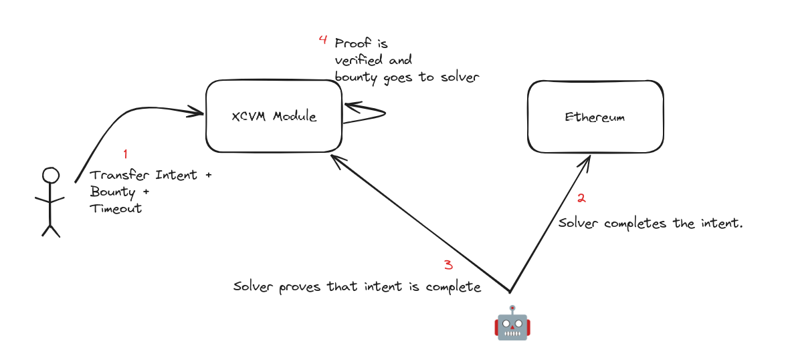

# x/xcvm
Programs targeting the Composable Virtual Machine (CVM) define cross-chain operations. Unfortunately, interpreting and executing these programs on Ethereum is prohibitively expensive.
The `x/xcvm` module is a solution to this problem that shifts CVM interpretation to Centauri by verifying the execution on Ethereum.

> ⚠ The current iteration of the xcvm module is a proof-of-concept prototype is not fully functional outside of ERC-20 transfer intents or tested on Ethereum mainnet.
> Test coverage handles the happy path cases but is not comprehensive with edge and error cases. ⚠

## ERC-20 Transfer Intents

First, the user submits a message specifying an intent. In this initial prototype, we focus on ERC-20 transfers of a specified amount and denomination to a given destination address on Ethereum. The user also posts a bounty of any size and denomination to incentivize “solvers” to execute the intent.

To fulfill an intent, a solver executes the desired operation on Ethereum; for a transfer intent, this would mean transferring the proper amount of ERC-20 tokens to the destination address the user specified.

The solver must prove the intent execution before obtaining the bounty on Centauri. We assume the Centauri chain has a built-in Ethereum light client (e.g., using IBC). The solver must prove the following properties about its intent execution.

1. **Who:** The solver is the one who executed the intent.
    1. The solver signs over the transaction receipt hash and block hash where the intent was executed using the same Ethereum account with which it fulfills the intent.
2. **What**: Execution uniquely fulfills all aspects of the user’s intent.
    1. The solver provides the Ethereum receipt of its ERC-20 transfer. The implementation must ensure the receipt has not been used to fulfill a similar intent before.
3. **When:** Execution occurred after the user submitted the intent.
    1. The timestamp on the execution block header is compared with a timestamp on the user’s intent.
4. **Where:** Execution occurred on Ethereum.
    1. Demonstrated by a merkle proof of the receipt’s inclusion in the execution block header and a proof of the execution block’s confirmation on the consensus layer.